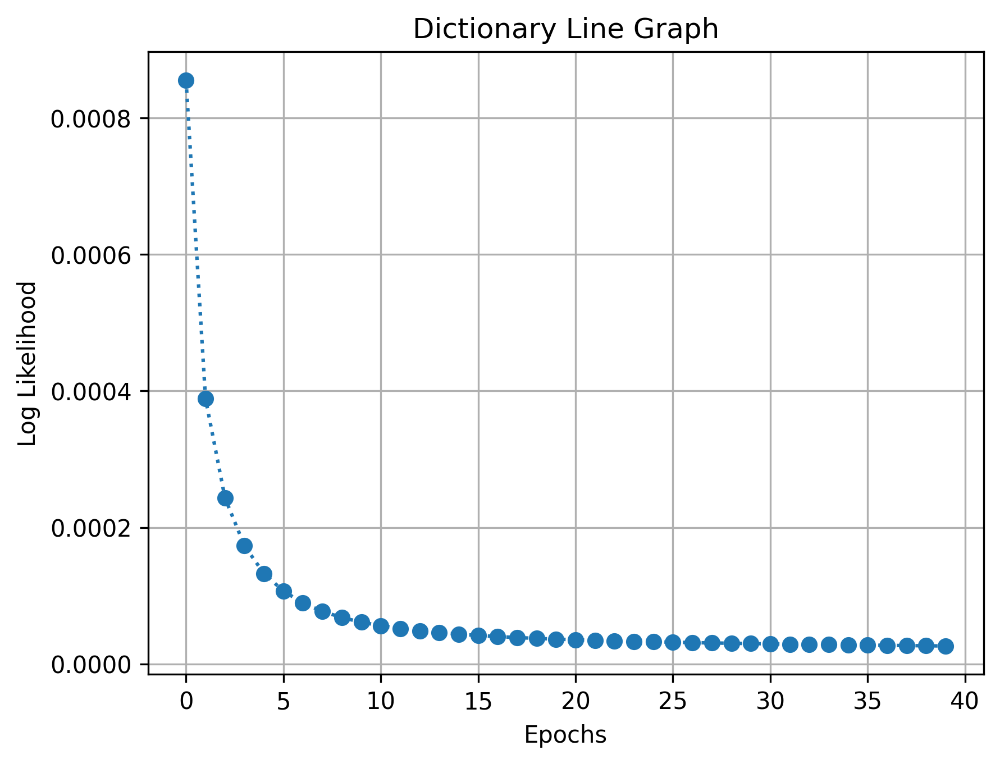
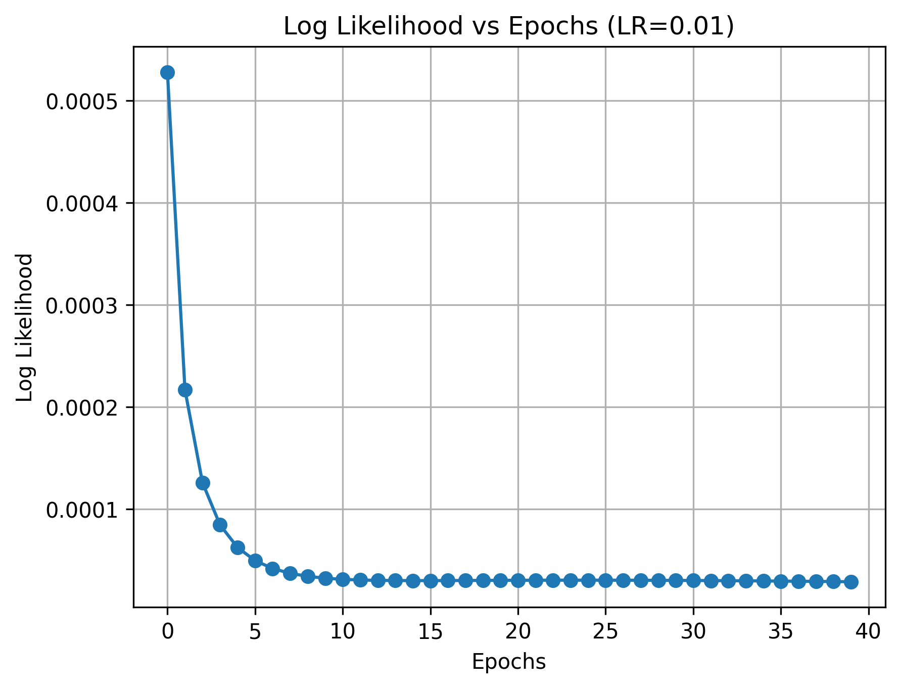
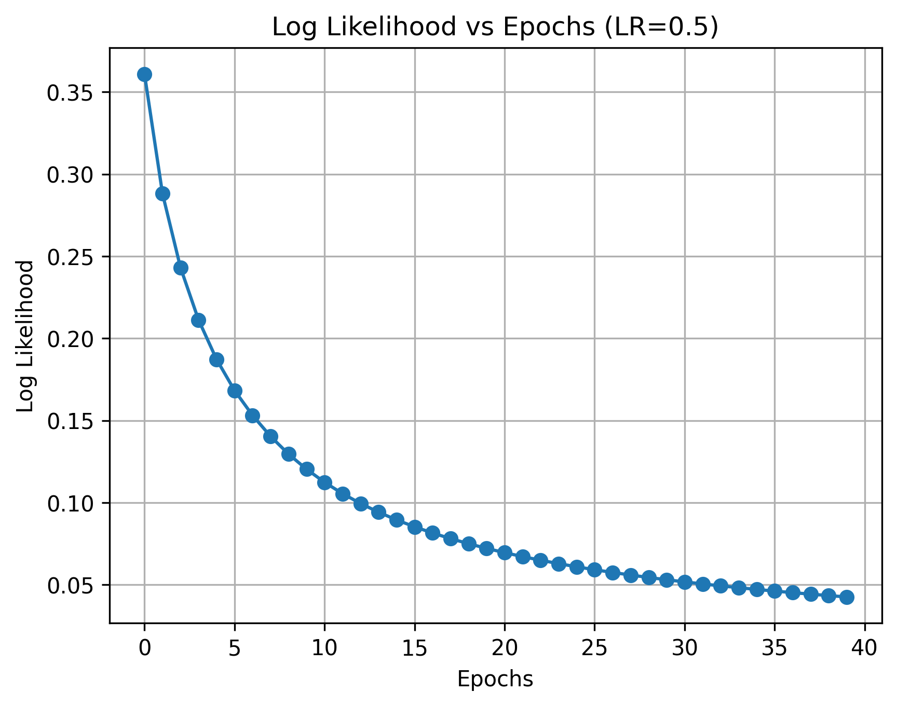
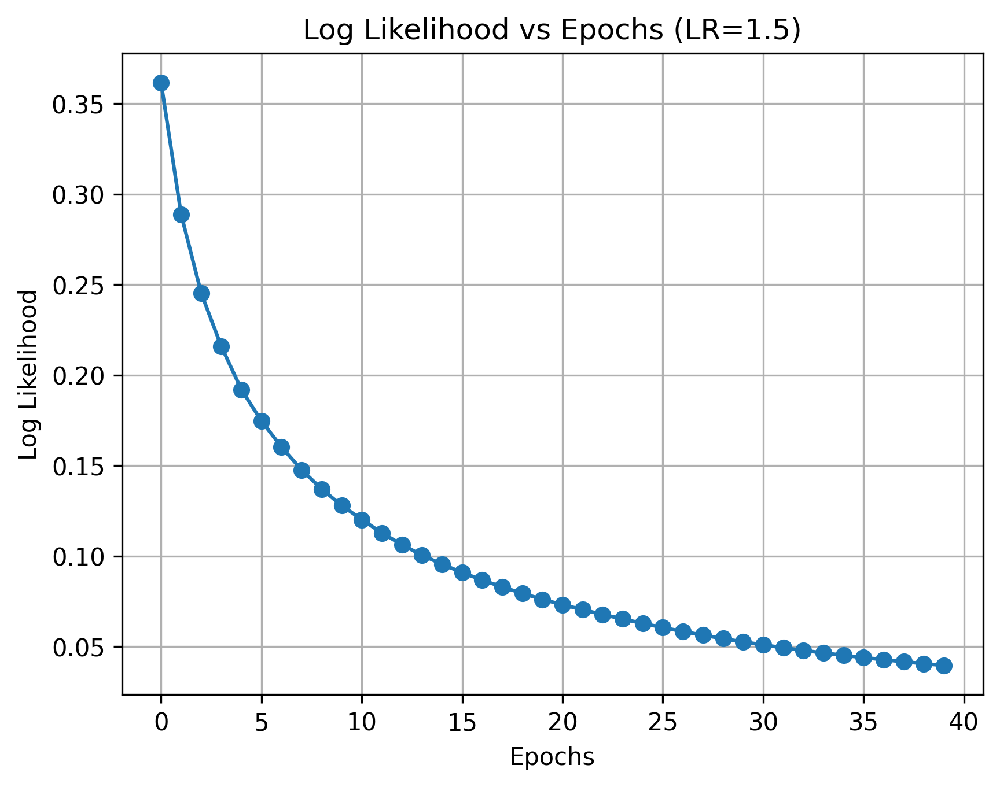
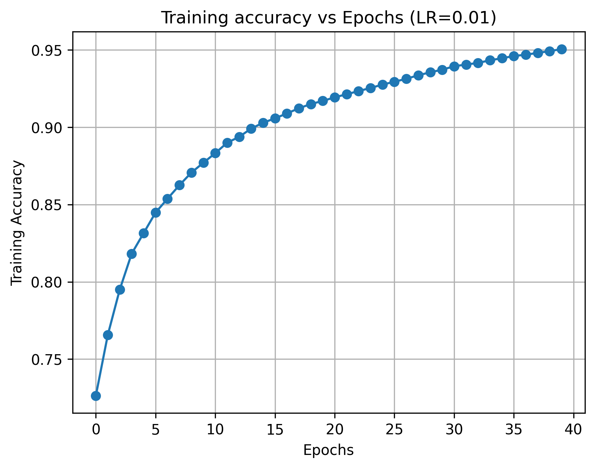
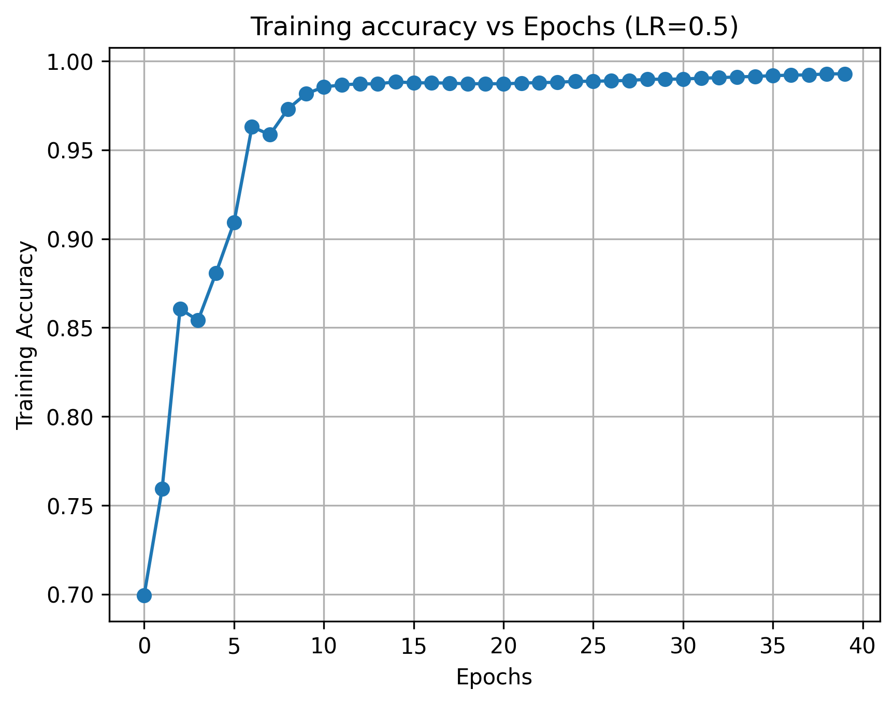
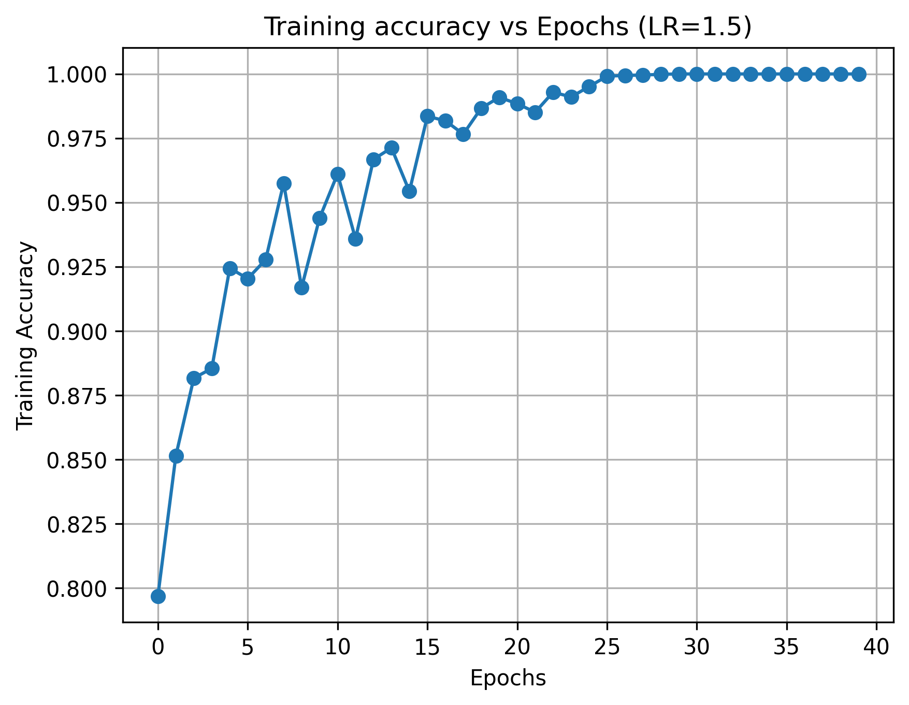
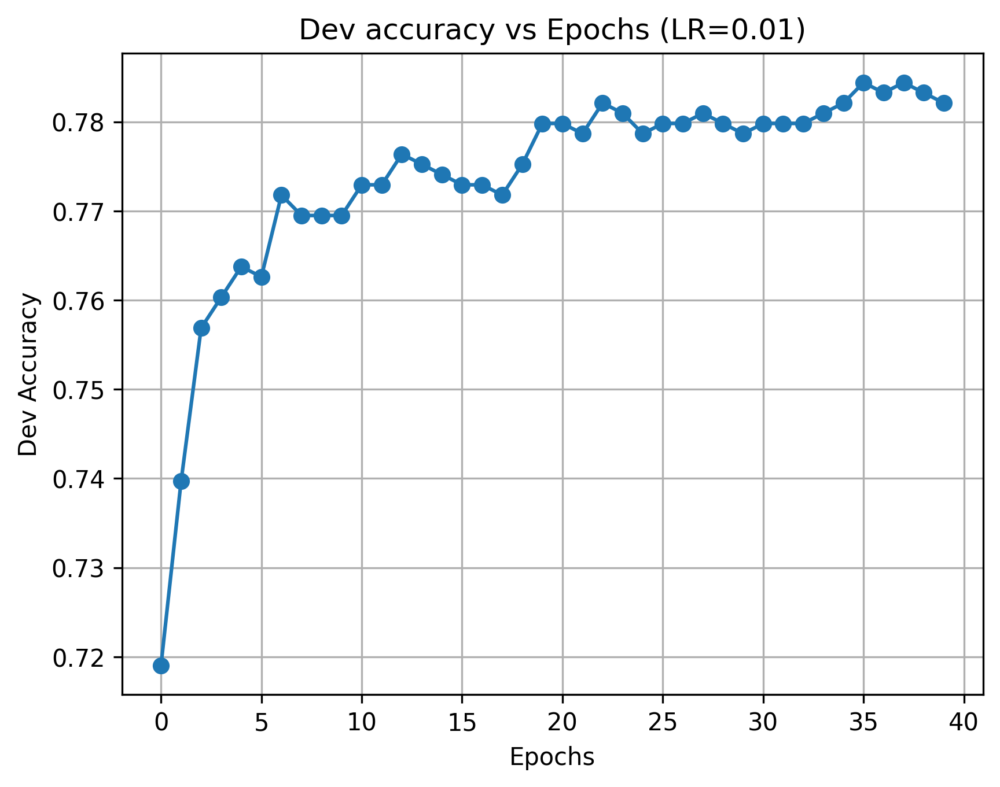
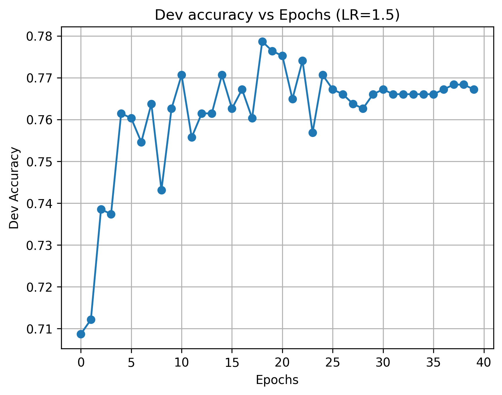

# Sentiment Analysis for Movie Reviews

This project implements and evaluates two linear models, Perceptron and Logistic Regression, for classifying the sentiment of movie reviews. The goal is to explore different feature extraction techniques and hyperparameter settings to achieve the best possible performance on a sentiment classification task.

## How to Run

### Prerequisites

The project requires Python 3, `numpy`, and `nltk`.

1.  **Install dependencies:**
    ```bash
    pip install numpy nltk
    ```

2.  **Download NLTK data:**
    Run the following Python commands to download the necessary `nltk` packages:
    ```python
    import nltk
    nltk.download('punkt')
    nltk.download('stopwords')
    nltk.download('wordnet')
    ```

### Training and Evaluation

The main script to run the models is `sentiment_classifier.py`.

**Usage:**
```bash
python sentiment_classifier.py --model [MODEL] --feats [FEATURE_SET]
```

-   `--model`: Specifies the classifier to use.
    -   `PERCEPTRON`: Perceptron classifier.
    -   `LR`: Logistic Regression classifier.
-   `--feats`: Specifies the feature extractor to use.
    -   `UNIGRAM`: Unigram features.
    -   `BIGRAM`: Bigram features.
    -   `BETTER`: Unigram features with stopword removal.

**Example:** To run the Logistic Regression model with Unigram features:
```bash
python sentiment_classifier.py --model LR --feats UNIGRAM
```

## Models and Features

### Models

-   **Perceptron:** A simple linear classifier trained with the Perceptron learning algorithm.
-   **Logistic Regression (LR):** A linear classifier that models the probability of a positive or negative review.

### Feature Extractors

-   **Unigram:** Represents the text as a bag-of-words, where each feature is a single word.
-   **Bigram:** Uses adjacent pairs of words as features to capture more context.
-   **Better:** A modified unigram extractor that removes common English stopwords before creating features.

## Results and Analysis

The following sections summarize the results of various experiments conducted to evaluate the models.

### 1. Unigram Perceptron Performance

The Unigram Perceptron model was trained for 10 epochs with an initial learning rate of 0.01 and a 10% exponential decay schedule.

| Metrics   | Training | Development |
| :-------- | :------- | :---------- |
| Accuracy  | 97.4%    | 76.0%       |
| Precision | 97.6%    | 75.7%       |
| Recall    | 97.6%    | 77.8%       |
| F1        | 97.6%    | 76.7%       |
| Time      | 2.73s    | 2.73s       |

### 2. Learning Rate Schedules

Three different learning rate schedules were tested for the Perceptron model:
1.  **Constant LR:** The learning rate remains constant.
2.  **Exponential Decay:** The learning rate is reduced by 10% after each epoch.
3.  **Inverse Decay:** The learning rate is updated at each iteration by dividing it by the number of epochs.

**Conclusion:** Constant LR and Exponential Decay produced the best results, with Exponential Decay performing slightly better.

### 3. Top Positive and Negative Words (Unigram LR)

The model learns to associate words with positive or negative sentiment. Here are the words with the highest and lowest weights:

| Top 10 Positive Words | Weights     | Top 10 Negative Words | Weights      |
| :-------------------- | :---------- | :-------------------- | :----------- |
| powerful              | 0.1251      | stupid                | -0.1463049   |
| spirit                | 0.119907521 | tv                    | -0.109681105 |
| manages               | 0.11060441  | suffers               | -0.106535205 |
| remarkable            | 0.10629     | mess                  | -0.1051      |
| rare                  | 0.104821441 | unfortunately         | -0.1051      |
| hilarious             | 0.101912846 | flat                  | -0.10070441  |
| appealing             | 0.101339957 | worst                 | -0.098943254 |
| solid                 | 0.10060441  | none                  | -0.098815777 |
| intriguing            | 0.100201136 | lazy                  | -0.097861    |
| refreshing            | 0.0975659   | unfunny               | -0.0951      |

### 4. Overfitting Analysis (Unigram Perceptron)

The model shows a clear tendency to overfit the training data as the number of epochs increases. While training accuracy continues to rise, development accuracy stabilizes around 75%.



| Epochs | Training Accuracy | Development Accuracy |
| :----- | :---------------- | :------------------- |
| 1      | 78.2%             | 69.6%                |
| 2      | 83.4%             | 71.4%                |
| 3      | 87.4%             | 73.2%                |
| 4      | 89.1%             | 72.6%                |
| 5      | 92.9%             | 75.0%                |
| 6      | 94.0%             | 75.6%                |
| 7      | 94.3%             | 74.0%                |
| 8      | 94.3%             | 75.0%                |
| 9      | 97.1%             | 75.1%                |
| 10     | 96.6%             | 74.7%                |

### 5. Unigram Logistic Regression Performance

The Unigram Logistic Regression model achieved the best overall performance on the development set, reaching the target of >77% accuracy.

| Metrics   | Training | Development |
| :-------- | :------- | :---------- |
| Accuracy  | 87.6%    | 78.0%       |
| Precision | 89.0%    | 79.0%       |
| Recall    | 87.0%    | 77.5%       |
| F1        | 88.0%    | 78.2%       |
| Time      | 2.67s    | 2.67s       |

### 6. Logistic Regression Learning Rate Comparison

The impact of different learning rates on the LR model's log-likelihood and accuracy was analyzed.

**Observations:**
-   A learning rate of **0.01** provides the best and most stable results.
-   Higher learning rates (0.5, 1.5) cause the model to converge more slowly and result in erratic accuracy, indicating instability.

| Learning Rate = 0.01                                       | Learning Rate = 0.5                                     | Learning Rate = 1.5                                     |
| :--------------------------------------------------------- | :------------------------------------------------------ | :------------------------------------------------------ |
|  |  |  |
|      |      |      |
|            |            |            |

### 7. Bigram Feature Performance

Using bigram features led to significant overfitting. Training accuracy approached 100%, but development accuracy was considerably lower than with unigram features.

| Model       | Metrics   | Training | Dev   |
| :---------- | :-------- | :------- | :---- |
| **Perceptron**  | Accuracy  | 100.0%   | 71.2% |
|             | F1        | 100.0%   | 71.7% |
| **Logistic Regression** | Accuracy  | 96.9%    | 71.9% |
|             | F1        | 97.0%    | 74.5% |

### 8. "Better" Feature Extractor Performance

Further experiments were conducted with advanced feature modifications, including TF-IDF and lemmatization. However, these techniques did not improve performance and often made it worse. The final `BetterFeatureExtractor` only implements stopword removal on top of unigrams.

This modification resulted in a slight accuracy improvement for the Logistic Regression model.

| Model (Better Features) | Metrics  | Performance |
| :---------------------- | :------- | :---------- |
| **Perceptron**          | Accuracy | 76.0%       |
|                         | F1       | 75.4%       |
| **Logistic Regression** | Accuracy | 77.8%       |
|                         | F1       | 78.1%       |

## Conclusion

The project demonstrates that for linear models like Perceptron and Logistic Regression on this sentiment analysis task:
-   **Unigram features provide a strong baseline.**
-   **Logistic Regression slightly outperforms Perceptron**, achieving a higher development accuracy (78.0%).
-   **More complex features like bigrams lead to severe overfitting** and degrade performance.
-   **Advanced NLP techniques like TF-IDF and lemmatization do not always help** and can hurt the performance of simple linear models.
-   **Hyperparameter tuning (like the learning rate) is critical** for achieving stable and optimal results.
